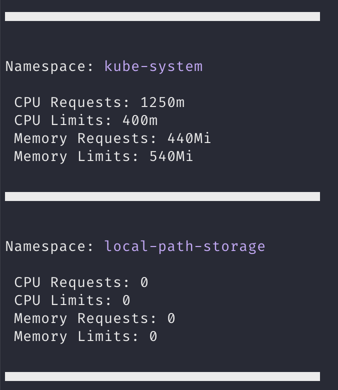

# kns - Kubernetes Namespace Resource Usage Tool


## Description

`kns` is a command-line tool that provides a quick overview of resource requests and limits for each namespace in a Kubernetes cluster.

## Installation

To install `kns`, follow these steps:

### From Binary

1. Download the latest binary for your operating system from the [Releases](https://github.com/braundo/kns/releases) page.
2. Make the binary executable (on Unix-like systems):
``` bash
chmod +x kns
```

3. Move the binary to a directory included in your system's PATH. For example, on Unix-like systems:
``` bash
sudo mv kns /usr/local/bin/
```
  

4. Now `kns` is installed and can be run from any location in your terminal.

### From Source

If you have Go installed and configured:

1. Clone the repository:
``` bash
git clone https://github.com/braundo/kns.git
```

2. Navigate into the cloned directory:
``` bash
cd kns
```
3. Build and install the binary:
``` bash
go install
```


This will compile the source code and place the `kns` binary in your `$GOPATH/bin` directory, which should be in your PATH if you've set up Go correctly.

## Usage

To run `kns`, simply type `kns` in your terminal.


Ensure you have your Kubernetes configuration file (kubeconfig) correctly set up, as `kns` uses it to interact with your Kubernetes cluster.

## Screenshot
